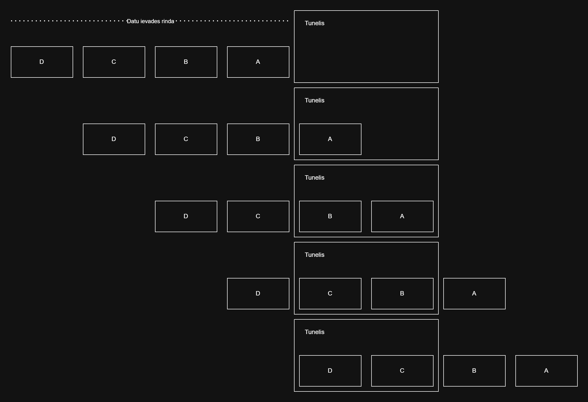
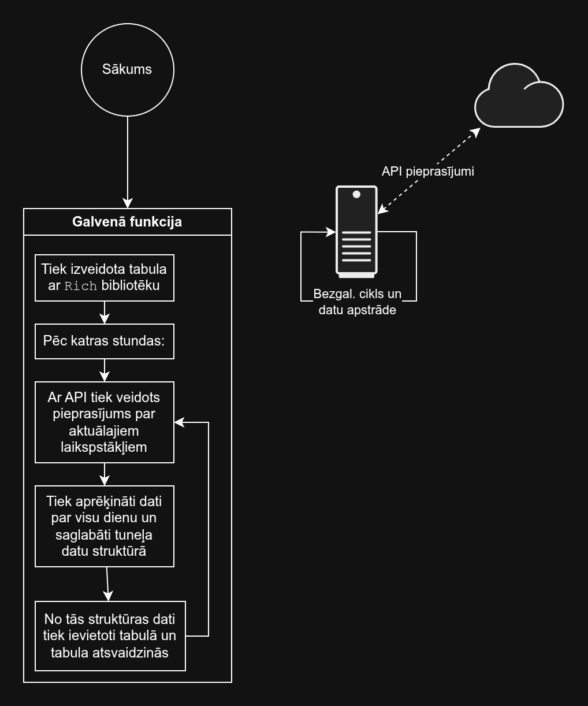

# `cli-weather`

`cli-weather` ir programmatūra, kas ļauj sekot dažiem konkrētiem laikapstākļiem iepriekš izvēlētajā vietā ─ Ķīpsalas studentu pilsētiņā ─ komandrindā. Pēc būtības šāds projekts ir papildināms, uzlabojams vai pielagojams citu cilvēku vajadzībām. Piemēram, ja kādam neinteresē spiediena rādītājs, var ātri nomainīt programmatūras pirmkodu tā, lai tāda parametra nebūtu, vai arī pievienot citus.

## Datu struktūra "Tunelis"

Domājot par to, kā šo struktūru varētu nosaukt, uzreiz izveidojās asociācija ar tuneli kalnā vai zemes paaugurā, kurā brauc vilciens. Vilcieni parasti vienā līnijā brauc tikai uz vienu pusi, bet tunelī, it īpaši mazā, viņiem var būt redzams gan sākums, gan beigas, bet vidējie vagoni paliks tunelī. Līdzīgi arī strādā šis tunelis. Tunelim ir ierobežots glabājamo objektu skaits (šajā uzdevumā, tas ir 7, kas sakrīt ar nedēļas dienu skaitu), elementi ir vienvirzieni saistīti. Mēģinot pārpildīt struktūru, vecākais elements (tas, kurš tika pievienots agrāk par citiem, šajā gadījumā tas ir struktūras `head` elements) tiek aizstāts ar tam sekojošo elementu (šādā veidā tiek atbrīvota vieta vēl vienam elementam), bet struktūras beigās tiek pievienots jauns elements ─ gluži kā vagoni, kas brauc tunelī. 

Shematiskajā attēlā virs šīs rindkopas ir vizualizēts strukrūras darbības princips, kur katrs burts ir struktūras elements. `head` elements vienmēr atrodas pa labi no visiem citiem elementiem šajā struktūras vizuālizācijā.

## Programmatūras loģika

Pēc programmas inicializācijas (104. r.), tiek izveidota laikapstāķļu datu glabātuve `weather_store` un startēta funkcija `main`, kurā notiek visi galvenie uzdevumi. Funkcija `test` netiek lietota, bet tā tika izmantota sākumā, lai pārbaudītu, vai pareizi strādā jaunā datu struktūra.

Izsauktajā funkcijā tiek veidota tabula ar *Rich* bibliotēkas instrumentiem un pēc katras stundas tās attēls tiek atsvaidzināts ─ tabula netiek izvadīta vēlreiz, bet tās dati tiek pārrakstīti. 

Katru reizi atsvaidzinot tabulu, tiek izveidots pieprasījums uz laikapstākļu lietojumprogrammu saskarni (angl. *API*), lai iegūtu datus par laikapstākļiem Ķīpsalas studentu pilsētiņā. Pēc veiksmīgā pieprasījuma, dati tiek apstrādāti, ņemot vērā, ka tie ir par katru stundu visām septiņām dienām. Dati par katru dienu ērtākai piekļuvei ir apkopoti vārdnīcā un vārdnīcas par visām dienām tiek augšuplādētas `weather_store` struktūrā. Tad tabula tiek formatēta un dienu datumi tiek ģenerēti ar `datetime` bibliotēkas funkciju palīdzību. Pēc tam dati par nokrišņiem tiek izņemti no struktūras, pārgrupēti no dienu vārdnīcām pēc kritērijiem par kritēriju kortēžiem pēc dienām. Kortēžs tiek izpakots pirms jaunas datu rindas pievienošanas tabulā un tas atkārtojas katram kritērijam.

Programmā nav nodrošināta tās pārtraukšana pēc lietotāja ievada, tā jāpartrauc ar ārējām metodēm ─ komandrindas loga aizvēršana vai ārkārta pārtraukšana ar `Ctrl+C` īsinājumtaistiņu.

## Lietotās bibliotēkas

- `requests` ─ datu saņemšanai no lietojumprogrammu saskarnes
- `time` ─ lai apturēt programmu uz stundu, pirms tā atsvaidzinās tabulu ar datiem
- `datetime` ─ īsākai datumu formatēšanai
- `rich` ─ datu formatēšanai komandrindā un ērtākai izvadīšanai (lai neizvadītu visu tabulu no jauna, bet tikai pārrakstītu datus)

## Izmantošanās metodes

Ja kāds dzīvo studentu pilsētiņā, viņš var datora darbvirsmas stūrī uzlikt logrīku ar komandrindu, kurā tiks izvadīta informācija par laikapstākļiem.

---

[Iaroslav Viazmitin](https://github.com/RTUtniy), [Daniels Trunovs](https://github.com/danielstrunovs)